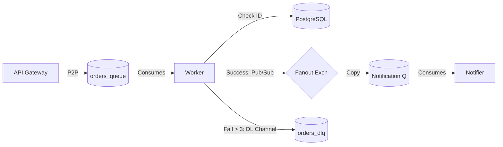

# Matriz de Patrones de Integración - IntegraHub

Esta matriz documenta las decisiones de diseño arquitectónico implementadas en la solución, justificando el uso de cada patrón y sus implicaciones.

| Patrón de Integración                   | Dónde se implementa                                                       | Justificación (Por qué)                                                                                                                                                                                    | Trade-offs (Compromisos)                                                                                                                          | Evidencia de Implementación                                                                                          |
| :-------------------------------------- | :------------------------------------------------------------------------ | :--------------------------------------------------------------------------------------------------------------------------------------------------------------------------------------------------------- | :------------------------------------------------------------------------------------------------------------------------------------------------ | :------------------------------------------------------------------------------------------------------------------- |
| **Point-to-Point Channel** (P2P)        | **API → Worker** (Cola: `orders_queue`)                                | Necesitamos desacoplar la recepción del pedido (rápida) del procesamiento de inventario/pagos (lento). Garantiza que solo un consumidor procese cada pedido específico.                                    | Aumenta la complejidad de la infraestructura (necesita broker). Si la cola se llena, aumenta la latencia del sistema.                             | `docker compose ps` muestra los servicios separados. RabbitMQ UI muestra la cola `orders_queue` recibiendo mensajes. |
| **Publish-Subscribe Channel** (Pub/Sub) | **Worker → Notification Service** (Exchange: `notifications_exchange`) | El evento "Pedido Confirmado" es de interés para múltiples sistemas (Email, Auditoría, Slack). Este patrón permite agregar nuevos suscriptores sin modificar el código del Worker (Principio Open/Closed). | El publicador (Worker) pierde control sobre quién recibe el mensaje. No hay garantía de entrega si no hay suscriptores conectados en ese momento. | RabbitMQ UI muestra el Exchange tipo `Fanout`. Logs del servicio `notifications` recibiendo eventos.                 |
| **Dead Letter Channel** (DLQ)           | **Worker → DLQ** (Cola: `orders_dlq`)                                  | Gestión de "Poison Messages". Si un pedido falla repetidamente (p.ej. datos corruptos o error de lógica), se mueve aquí para no bloquear el procesamiento del resto de la cola.                            | Requiere un proceso manual o secundario para revisar y reinsertar los mensajes fallidos. Añade configuración extra a RabbitMQ.                    | Configuración `x-dead-letter-exchange` en el Worker. Logs mostrando "Max reintentos alcanzados" y movimiento a DLQ.  |
| **Idempotent Consumer**                 | **Inventory Worker** (Lógica de verificación)                          | RabbitMQ garantiza entrega "At-least-once". Ante fallos de red (ACK perdido), un mensaje puede duplicarse. La idempotencia evita cobrar o reservar stock dos veces.                                        | Introduce una lectura extra a la Base de Datos antes de procesar (`SELECT status FROM orders`), lo que añade una pequeña latencia.                | Código en `main.py` (Worker): `if order.status != "PENDING": return`                                              |
| **Message Translator**                  | **Legacy Service** (CSV Parser)                                        | El sistema externo (ERP Legado) envía datos en formato CSV, pero nuestro dominio interno usa modelos relacionales (SQL). El servicio actúa como traductor para normalizar la data.                         | Costo computacional de parseo y validación de tipos de datos. Mantenimiento de reglas de mapeo si el CSV cambia.                                  | Código en `legacy-service/main.py` transformando filas CSV a objetos ORM `Order`.                                    |
| **Guaranteed Delivery** (Persistencia)  | **RabbitMQ Configuration**                                                | Los pedidos son críticos (dinero). Las colas y mensajes se declaran como `durable=True` y `delivery_mode=2`.                                                                                               | Escritura en disco en el Broker, lo que reduce el throughput (mensajes por segundo) comparado con colas en memoria.                               | Declaración de colas en código Python: `channel.queue_declare(durable=True)`                                      |

## Diagrama de Flujo de Patrones

